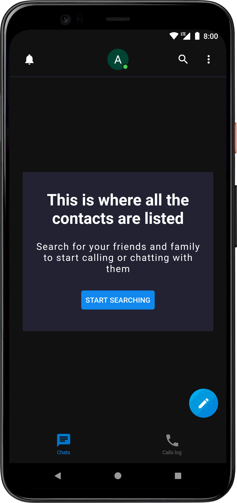
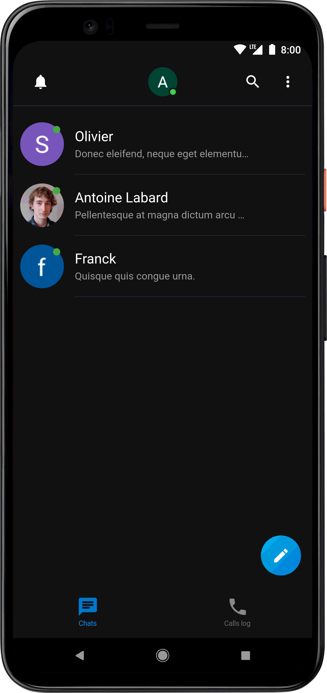
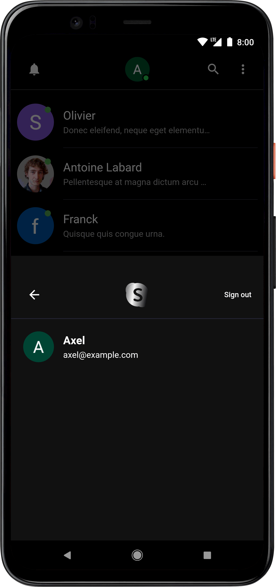
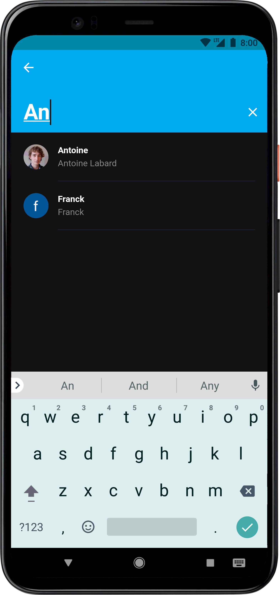
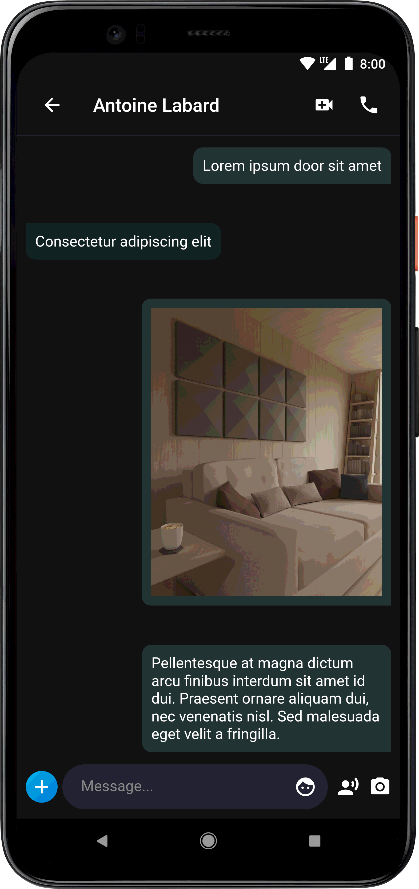
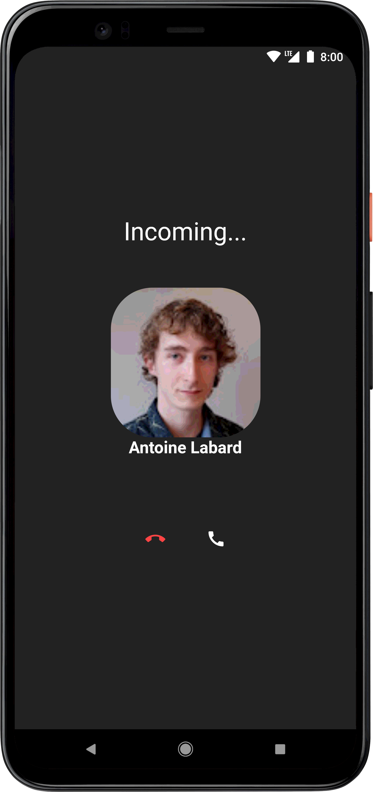

# Skype Clone

App implementing the main features of [Skype](https://www.skype.com/).

The app uses Flutter for its UI and the user data are stored in the cloud using [Firebase](https://firebase.google.com/)
. Videos called are handled by [Aroga](https://www.agora.io/).

## Features:

- authentication using a Google account.
- Possibility to chat and add other users as contact.
- Video calls between two users.
- Possibility to look for a user among those logged in.

## Images

## Credit

[The CS Guy](https://www.youtube.com/playlist?list=PLTHrJfrjCyJDlOLSIT3bm2xCCuPanUNX4)